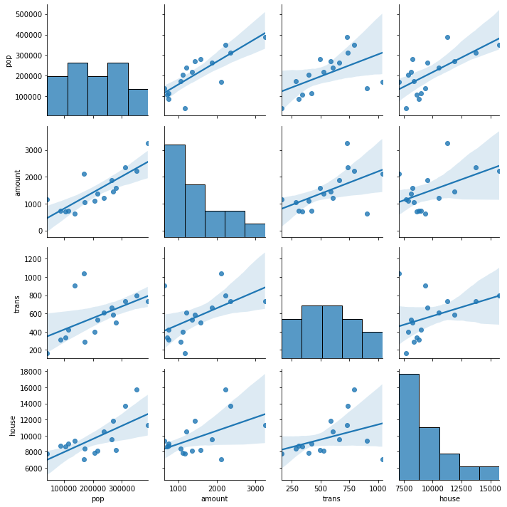

# 불연성쓰레기(non-combustible waste)

## 불연성쓰레기란?
일반폐기물 가운데 도자기, 유리, 패류 껍데기, 뼈다귀, 고양이 배변모래 등 불에 타지 않아 소각할 수 없는 쓰레기
## 프로젝트 목적
부산시 주택가 불연성쓰레기 수거함 도입을 위한 현황 조사 및 최적 입지 분석
## 프로젝트 계획 이유
- 산발적인 전용 마대 판매처
- 배출 방법에 대한 시민들의 낮은 인식
- 판매처별로 상이한 마대 규격(5ℓ~75ℓ)
- 소량 배출에도 비용 · 용량에 대한 부담, 일반 종량제 혼합배출로 이어짐
- 부산시 정책은 ‘100세대 이상 공동주택’에 한정, 주택가 수거함 부재
- 문전수거로 인한 수거원의 업무 과중
- 2단계 폐기 과정에 따른 추가 비용 발생
- 혼합배출에 따른 소각시설 잦은 고장 및 효율성 저하

## 분석 프로세스
---
### 데이터 수집 및 전처리
- 불연성쓰레기 수거함 도입에 있어 현황, 접근성, 관리성 요인으로 확인
    - 현황 확인: 구군별 불연성쓰레기 배출량 데이터 수집·정제
    - 접근성 요인: 인구, 주택, 경사도 데이터 수집·정제, 사용가능한 데이터 셋 준비
    - 관리성 요인: 수거함 관리 방식을 고려하여 관공서, 무단투기cctv 현황 데이터 수집·정제
### 활용 데이터

#### 접근성

|활용데이터|제공기관|
|:--:|:--|
|인구비율정보|통계청 국가통계포털
|부산광역시 정체 세대 및 인구 개황|통계청 국가통계포털|
|토지특성정보|국가교통부 국가공간정보포털|
|용도별 건물정보|국토교통부 국가공간정보포털|
|공영 주차장 현황|부산 부비카정보시스템|
|부산광역시 버스 정류소 정보|공공 데이터 포털|
|부산광역시 지하철역 정보|공공 데이터 포털|

#### 현황 확인
|활용데이터|제공기관|
|:--:|:--|
|행정구역-시군구|국가교통부 국가공간정보포털|
|불연성쓰레기 배출량 통계|부산시청 생활쓰레기 발생현황|
|도로 폭|국가교통부 국가공간정보포털|
|토지소유정보|국토교통부국가공간정보포털|

#### 관리성
|활용데이터|제공기관|
|:--:|:--|
|무단투기 cctv 설치 현황|부산시 각 구청 정보공개 데이터|
|관공서 구군 행정기관 현황|공공데이터포털|
### 데이터 분석 및 모델링
- 현황, 접근성, 관리성으로  나눈 데이터를 선형회귀 분석을 통해 군집 요인 및 입지 요인으로 나누어 유의미한 요인 선별

|구분|요인|
|:------:|:------|
|군집요인|불연성쓰레기 배출량, 대중교통 수, 면적대비 주택수|
|입지요인(주거요인)|인구많은 구역, 주거지 밀집 구역, 완경사 및 평지|
|입지요인(시설요인)|공원, 주차장|
|입지요인(관리요인)|관공서, 무단투기cctv 설치 구역|

- 선별된 군집 요인을 계층적 군집 분석을 통해 부산시 16개 구군 군집화
- 막대그래프로 형성된 군집별 특성 파악
- 신뢰성있는 전문가 의견을 바탕으로 AHP 분석, 입지 요인과 군집 요인의 세부 가중치 산출, 최종 입지 군집 선정

#### 군집 요인 선정
- 선형회귀 분석을 통해 불연성쓰레기 배출량과 인구의 상관관계를 도출
- 인구는 군집으로 분류될 수 있기 떄문에 인구와 밀접한 요인들을 선형회귀 분석하여 군집 요인 도출
--> 불연성쓰레기 배출량, 대중교통 수, 주택수



#### 입지 요인 선정

- 주거요인
    - 불연성쓰레기 배출량과 선형회귀 분석을 통해 상관관계 도출
    - **인구가 많은 지역, 주거지 밀집 구역, 완경사 및 평지 구역**


- 시설요인

    
    > 강명지, 'GIS를 이용한 쓰레기 소각장 입지 선정에 관한 연구' 참고

    - 논문의 환경적 요인의 '인문 환경의 토지 이용 속성'과 기술적 요인의 '기초 지반 상태 및 부지 조성 속성'을 인용, 요인선정
    - 공원: 쓰레기 배출에 용이하고 수거함 설치 편리(기술적 요인 - 편리성 측면)
    - 공영 주차장: 단독 주택 밀집 구역에 가까운 공영 주차장(환경적 요인 - 접근성 측면)
- 관리 요인
    - 논문의 사회적 요인의 '주민의식 속성'과 경제적 요인의 '시설비 및 운영관리비 속성'을 인용, 요인설정
    - 관공서 및 무단투기 cctv 설치 구역: 수거함 관리 용이(사회적 요인, 경제적 요인 - 관리성 측면)

#### 계층적 군집 분석(Hierarchical Clustering)
- 구군별 데이터로 유사한 특성을 갖는 군집 형성 과정 파악
- *single*, *complete*, *average*, *centroid*, *ward* 중 *complete* 방법으로 부산시 16개 구군을 세 군집으로 군집화(*complete*: 군집 요소들 간 거리 중 가장 큰 수치를 군집 간 거리로 설정)

```python
linkage_list = ['single','ward','average','centroid','complete']
data = df_sc
labels = df_sc.index.to_list()
fig = plt.figure(figsize=(12, 12), facecolor='white')
for i in range(len(linkage_list)):
    ax = fig.add_subplot(3, 2, i + 1)
    hierarchical = linkage(data, method=linkage_list[i])
    dn = dendrogram(hierarchical, labels=labels, ax=ax, leaf_rotation=45)
    ax.title.set_text(linkage_list[i])
fig.suptitle('Method 별 계층적 군집 분석 결과', fontsize=16)
plt.tight_layout()
```


#### 군집 수 선정
Dendrogram(계층도)를 참고하여 총 16개 구군을 3개의 군집으로 선정


#### 군집별 특성 분석
- 계층적 군집 분석으로 나눈 세 가지 군집을 막대그래프를 활용해, 군집별 유사성 파악
    - 군집 1(불연성쓰레기 배출량이 많은 군집):진구, 동래구, 남구, 북구, 해운대구, 사하구, 금정구, 사상구
    - 군집 2(유동인구가 많은 군집): 강서구, 기장군
    - 군집 3(면적 대비 주택수가 많은 군집): 서구, 중구, 동구, 영도구, 연제구, 수영구

```python
agg_df = AgglomerativeClustering(n_clusters=3, affinity='euclidean', linkage='complete')
predict = agg_df.fit_predict(df_sc)
df_sc['cluster'] = predict

cluster = df_sc.copy().groupby('cluster').median()
cluster = cluster.iloc[[0, 2, 1],:]
cluster.index = ['군집1','군집2','군집3']

fig = plt.figure(figsize=(12,12), facecolor='white')
ax = fig.add_subplot(1,1,1)
cluster.plot(kind='bar', ax=ax, title='군집별 현황', rot=0)
plt.legend(fontsize=12, loc='best')
plt.show()
```


#### 계층적 분석 과정(AHP: Analytic Hierarchy Process)
AHP분석이란, ***평가기준이 다수인 문제 상황에서 이원(쌍대)비교를 통해 선호도를 비교하여 정량적 · 정성적 요소 평가***
- AHP 설문 구성


- AHP 연산 과정
대상을 A, 각각의 가중치를 W로 정의하고 n개의 대상간 이원(쌍대)비교행렬로 표현
이원(쌍대)비교행렬로 부터 *Eigenvalue Method*를 거쳐 특정 기준 하에서 대안들의 상대적 선호도의 기준들의 가중치 도출
    
    

- 판단의 일관성 측정
Λmax(Max Eigenvalue)가 *n*에 어느정도 근접했는지 알 수 있는 척도를 통해 일관성지수(*CI*) 추출 후, 평균 무작위지수(*CR*) 추출

    

- 가중치 도출 결과

신뢰성 있는 전문가들의 AHP 설문 결과를 바탕으로 일관성 비율(CR < 0.2) 만족시키는 설문 5건에 한해 가중치 도출
(CR이 0.2미만이면 가용범위의 일관도라고 판단)

#### 선정 결과
- 1순위 - 0.476(최종 가중치)
**군집 3**: 면적대비 주택수가 많은 군집
    - 서구, 중구, 동구, 영도구, 연제구, 수영구

- 2순위 - 0.374
**군집 1**: 불연성쓰레기 배출량이 많은 군집
    - 진구, 동래구, 남구, 북구, 해운대구, 사하구, 금정구, 사상구

- 3순위 - 0.150
**군집 2**: 유동인구가 많은 군집
    - 강서구, 기장군

#### 가중치 선정 결과


#### 최종 입지 선정에 필요한 총점 계산
- 가중치 설정
``` python
"""
군집1: 불연성쓰레기 배출량이 많은 군집
- 진구, 동래구, 남구, 북구, 해운대구, 사하구, 금정구, 사상구

군집2: 유동인구가 많은 군집
- 강서구, 기장군

군집3: 면적대비 주택수가 많은 군집
- 서구, 중구, 동구, 영도구, 연제구, 수영구
"""
score = ['POP','주택가','경사도','공원','주차장','관공서','CCTV']
# 군집 1 진구, 동래구, 남구, 북구, 해운대구, 사하구, 금정구, 사상구
cluster_1_weight = [0.094, 0.088, 0.037, 0.019, 0.007, 0.043, 0.086]
# 군집 2 강서구, 기장군
cluster_2_weight = [0.014, 0.037, 0.009, 0.008, 0.006, 0.024, 0.005]
# 군집 3 서구, 중구, 동구, 영도구, 연제구, 수영구
cluster_3_weight = [0.108, 0.162, 0.048, 0.017, 0.009, 0.034, 0.1]

```
- 정규화
``` python
from sklearn.preprocessing import MinMaxScaler
# MinMax 정규화
scaler = MinMaxScaler()

norm = df.copy()
norm.fillna(0, inplace=True)

norm[score] = scaler.fit_transform(norm.loc[:, score])
# 계산에 필요하지 않는 columns
reset = ['left','bottom','right','top','gid']
```
- 총점 계산
``` python
data = norm.copy()

for i in range(len(score)):
    cols_name = score[i]
    data[cols_name] = data[cols_name] * cluster_1_weight[i] # 군집 1
    # data[cols_name] = data[cols_name] * cluster_2_weight[i] # 군집 2
    # data[cols_name] = data[cols_name] * cluster_3_weight[i] # 군집 3
data_df = data.set_index(reset)

data_df['sum'] = data_df.sum(axis=1)
data_df.reset_index(inplace=True)
data_df.head()
```
- 순위 계산
```python
data_df['rank'] = data_df['sum'].rank(method='dense', ascending=False).astype(int)

final = data_df.sort_values(by='rank')
final.reset_index(drop=True, inplace=True)
```

- 결과 Sample


### 활용방안

#### 문제점 및 개선 방안

- (비용) 2018년 기준 '100 세대 이상 공동주택' 수거함 5,760개 도입에 든 비용 6억 8천만원. 수거함 설치로 인한 분리배출감소 비용(연간 폐기물처분부담금 약 1,900만원, 시설당 손실비용 4,000만원) 대비 초기 투입 비용이 높아 장기적인 관점 필요
- (무단투기) 무단투기 cctv보다 더 체계적인 관리 필요. 고정식·이동식 수거함의 장단점을 고려하여 세부적인 관리 방식에 대한 추가 논의
- (여론 반영) 입지 분석 및 선정 단계에서 고려된 요인은 정량적, 개관적 수치이므로 주민 여론과 같은 정성적 요소 고려되지 않음

#### 업무 활용 방안
- 기대효과
    - (현재 정책 개선) 100세대 이상의 공동주택에만 한정되어 있는 불연성쓰레기 수거함의 확대 설치로 분리배출량 증가 도모
    - (시민 인식 개선) 분리배출의 편의성 및 접근성 향상으로 배출 방식에 대한 인식 촉진, 환경 친화적인 삶에 대한 참여 유도
    - (처리 비용 최소화) 폐기물처분부담금, 시설 유지보수, 지역 환경 보전 비용 감소에 기여
    - (노동 환경 개선) 수거원과 처리원의 효율적인 업무 가능, 깨진 자기류·동물 뼈다귀 등 폐기물 특성에 따른 문전수거의 위험도 감소
    - (수거차 노선 최적화) 불연성쓰레기 배출 지정 요일에 수거차 노선 단축, 최적의 동선으로 폐기물 수거 가능
    - (환경 보호) 불완전연소로 발생하는 일산화탄소 배출량 감소, 재활용률 증가, 자원순환률 향상
- 업무 활용 방안
    - (정책 활용) 지역 화폐 등 리워드 제공을 통한 서비스 홍보로 시민 접근성 증대, 분리배출-환경 보호-경제 활성화의 선순환 구조 창출
    - (일자리 창출) 수거함 지정 관리인을 지역 주민들로 구성하여 분리배출 방법 안내 및 지역 경제 활성화
    - (홍보 캠페인 실시) 분리배출 홍보 캠페인으로 시민사회 인식 제고 모범 사업 모델로 활용
    - (친환경 안전 도시) 전국 최초 수거함 도입 및 확대 시행으로, 시민의 편리와 더불어 미화원의 업무와 안전까지 고려하는 친환경 안전 도시의 선도적인 이미지 구축
